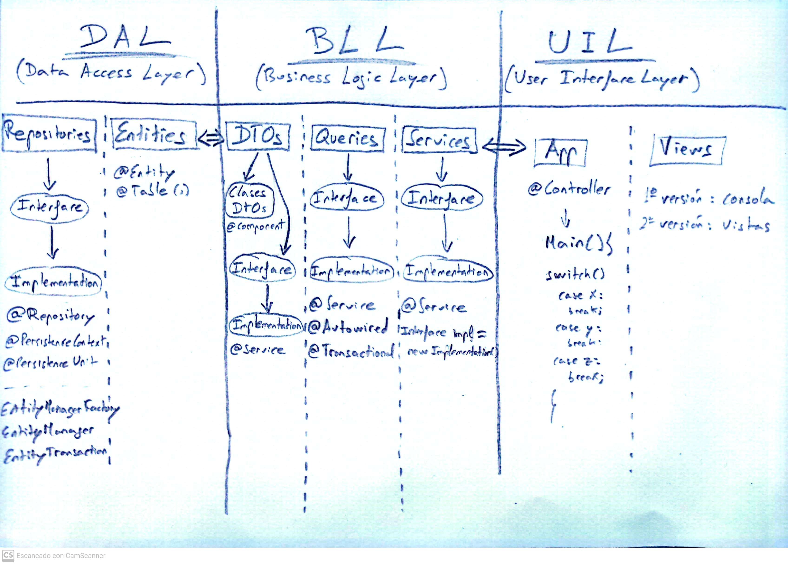
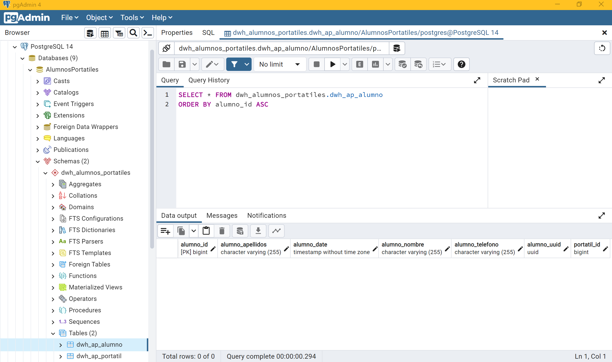
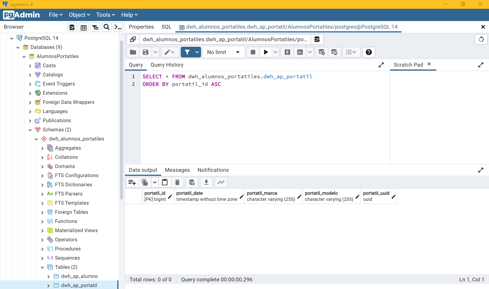

# Gestión material en préstamo a alumnos

- [Gestión material en préstamo a alumnos](#gestión-material-en-préstamo-a-alumnos)
  - [Enunciado](#enunciado)
  - [Menú ampliado (propuesta menu con opciones extras)](#menú-ampliado-propuesta-menu-con-opciones-extras)
  - [Esquema de la Arquitectura del ejercicio](#esquema-de-la-arquitectura-del-ejercicio)
  - [Tabla Alumno en la BBDD](#tabla-alumno-en-la-bbdd)
  - [Tabla Portatil en la BBDD](#tabla-portatil-en-la-bbdd)
  - [Webgrafía](#webgrafía)
    - [Three Tier (Three Layer) Architecture in Spring MVC Web Application](#three-tier-three-layer-architecture-in-spring-mvc-web-application)
    - [How to configure persistence.xml file - Beginner’s Guide to JPA’s persistence.xml](#how-to-configure-persistencexml-file---beginners-guide-to-jpas-persistencexml)
    - [How to generate a UUID](#how-to-generate-a-uuid)
    - [Calendar Class in Java with examples](#calendar-class-in-java-with-examples)
    - [PersistenceUnit vs PersistenceContext (Stackoverflow discussion)](#persistenceunit-vs-persistencecontext-stackoverflow-discussion)
    - [Entity Manager \& Persistence Context (and type = PersistenceContextType)](#entity-manager--persistence-context-and-type--persistencecontexttype)
    - [Difference Between @JoinColumn and mappedBy](#difference-between-joincolumn-and-mappedby)
  - [Solución de Errores](#solución-de-errores)
    - [Versión de Hibernate](#versión-de-hibernate)
    - [Hibernate’s “Detached Entity Passed to Persist” Error](#hibernates-detached-entity-passed-to-persist-error)
    - [How to remove a detached instance (Stackoverflow discussion)](#how-to-remove-a-detached-instance-stackoverflow-discussion)
    - [@OneToMany/@ManyToOne(fetch = FetchType.EAGER) - Hibernate could not initialize proxy – no Session](#onetomanymanytoonefetch--fetchtypeeager---hibernate-could-not-initialize-proxy--no-session)
    - [Update/Delete query --\> TransactionRequiredException Error](#updatedelete-query----transactionrequiredexception-error)
  - [Funcionalidades extras no implementadas](#funcionalidades-extras-no-implementadas)
  - [Excepciones no controladas](#excepciones-no-controladas)
  - [Prueba de Ejecución](#prueba-de-ejecución)

## Enunciado

Cuando un alumno se matricula en un instituto se le asigna un portátil para trabajar. Mientras el alumno esté matriculado, usará siempre el mismo portátil. 
Es imprescindible conocer en todo momento qué portátil tiene un alumno y a qué alumno corresponde un portátil.

De cada alumno tendremos que guardar su número de alumno, nombre y teléfono. De cada portátil tendremos que guardar el número identificador (una pegatina que se le pone a cada equipo con un número diferente), su marca y modelo.

Diseña una aplicación con el siguiente menú:

1. Matrícula de alumno. 
2. Baja de un alumno.
3. Alta de portátil.
4. Consulta portátil asignado a un alumno (se conoce el número de alumno se busca el portátil).
5. Consulta alumno asignado a un portátil (se conoce el identificador del portátil se busca el alumno).
6. Ver todos los alumnos con su asignación de portátil.
0. Salir.

Requisitos mínimos:

Clases y métodos comentados. 
Excepciones y errores controlados.
Usar JPA e Hibernate con la configuración vista en clase.
Usar MVC con la arquitectura vista en clase.
La aplicación se desarrollará con interacción por consola.

## Menú ampliado (propuesta menu con opciones extras)

1. Matrícula de alumno. 
2. Baja de un alumno.
3. Alta de portatil.
4. Baja de portátil.
5. Consulta portátil asignado a un alumno (se conoce el número de alumno se busca el portátil).
6. Consulta alumno asignado a un portátil (se conoce el identificador del portátil se busca el alumno).
7. Ver todos los alumnos con su asignación de portátil.
8. Ver todos los portátiles con su alumno asignado.
0. Salir.

## Esquema de la Arquitectura del ejercicio

## Tabla Alumno en la BBDD

## Tabla Portatil en la BBDD

## Webgrafía

### Three Tier (Three Layer) Architecture in Spring MVC Web Application

https://www.javaguides.net/2020/07/three-tier-three-layer-architecture-in-spring-mvc-web-application.html

### How to configure persistence.xml file - Beginner’s Guide to JPA’s persistence.xml

https://thorben-janssen.com/jpa-persistence-xml/

### How to generate a UUID

https://www.baeldung.com/java-uuid

### Calendar Class in Java with examples

https://www.geeksforgeeks.org/calendar-class-in-java-with-examples/?ref=lbp

### PersistenceUnit vs PersistenceContext (Stackoverflow discussion)

https://stackoverflow.com/questions/21038706/persistenceunit-vs-persistencecontext

### Entity Manager & Persistence Context (and type = PersistenceContextType)

https://www.oscarblancarteblog.com/2017/02/21/entitymanager-persistencecontext/

### Difference Between @JoinColumn and mappedBy

https://www.baeldung.com/jpa-joincolumn-vs-mappedby

## Solución de Errores

### Versión de Hibernate

Las versiones de hibernate más actuales me han dado errores.
Este ejercicio lo he conseguido hacer con la versión de Hibernate 5.6.12.Final.

### Hibernate’s “Detached Entity Passed to Persist” Error

Para solucionarlo, podemos hacer los siguientes dos cambios:

- @ManyToOne(cascade = CascadeType.ALL)	   -->	@ManyToOne(cascade = CascadeType.MERGE)
- entityManager.persist(repostajeVehiculo) -->  entityManager.merge(repostajeVehiculo)
  
https://www.baeldung.com/hibernate-detached-entity-passed-to-persist

### How to remove a detached instance (Stackoverflow discussion)

https://stackoverflow.com/questions/17027398/java-lang-illegalargumentexception-removing-a-detached-instance-com-test-user5

### @OneToMany/@ManyToOne(fetch = FetchType.EAGER) - Hibernate could not initialize proxy – no Session

https://www.baeldung.com/hibernate-initialize-proxy-exception

### Update/Delete query --> TransactionRequiredException Error

https://www.baeldung.com/jpa-transaction-required-exception

## Funcionalidades extras no implementadas

1. Que se pueda matricular un nuevo alumno sin asignar ningún portatil
2. Que a un alumno sin portatil se le pueda asignar uno más tarde

## Excepciones no controladas

1. Que no se pueda dar de baja un portátil que está asignado a un alumno
2. Que cuando se de el alta a un alumno no se pueda elegir un portatil que ya esté asignado

## Prueba de Ejecución

[Prueba de ejecución - Gestión de Alumnos y Portátiles](https://user-images.githubusercontent.com/91122596/215562527-4dd6c3e5-e8b5-4bc4-8cf3-eff66453ab3f.mp4)